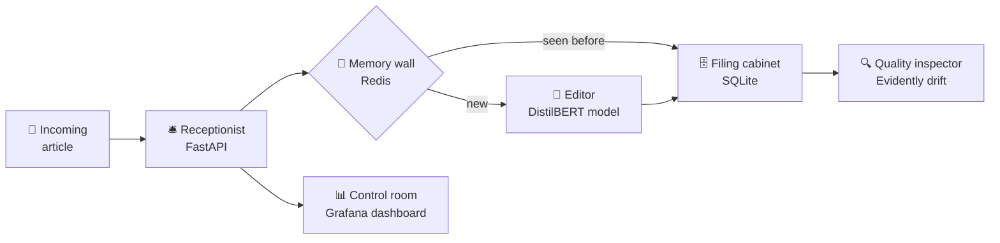
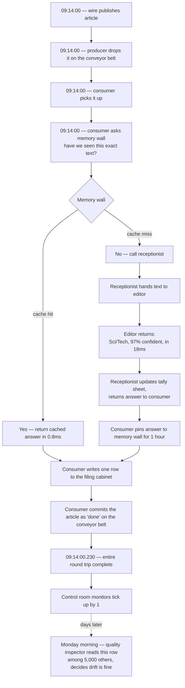

# Architecture, in plain English

A non-technical walkthrough of how Content Intel works. If you want the
dense version with sequence diagrams and schemas, see
[`architecture.md`](architecture.md).

---

## What this thing actually does

In one sentence: it reads news headlines and tells you whether they're
about *World, Sports, Business,* or *Sci/Tech* — and it does that
thousands of times a day, watches itself for problems, and shows you
everything on a live dashboard.

You can try it yourself at
[`pranavsagar.github.io/classify/`](https://pranavsagar.github.io/classify/).

---

## The newsroom analogy

Imagine a small newsroom with very specific staff:

- An **editor** who has read 120,000 news articles and is now extremely
  good at deciding what section each new one belongs in.
- A **receptionist** who takes incoming articles, hands them to the
  editor, and reports back with the answer.
- A **conveyor belt** that carries a continuous stream of articles past
  the editor so they don't have to be handed over one-by-one.
- A **memory wall** of recently seen articles so the editor doesn't redo
  work when the same wire story comes in from ten different outlets.
- A **filing cabinet** that keeps a record of every decision the editor
  has ever made.
- A **quality inspector** who walks through the filing cabinet every
  week and checks whether the editor's decisions still look healthy.
- A **control room** with monitors showing, live, how fast the editor is
  working and what the breakdown of decisions looks like.

Every one of those people and objects maps to a real piece of software
in this project.

---

## The cast of characters

### 1. The editor — the trained model

A small AI model called **DistilBERT** was shown 120,000 example news
articles, each one labelled by humans. Over about 82 minutes of
"training", it learned the patterns that distinguish a sports headline
from a business one. Today it gets the right category **94.64% of the
time** on articles it has never seen.

The editor lives on a free hosting service called **HuggingFace Hub**.
When the system boots up, it downloads the editor into memory.
Everything else in this newsroom is plumbing around that one decision-
maker.

> Technical detail: see [§4.1 Inference flow](architecture.md#41-inference-flow--post-classify-synchronous-hot-path).

### 2. The receptionist — the FastAPI server

When you (or anything else) want a headline classified, you talk to the
**receptionist**. They:

1. Check the article isn't empty.
2. Hand it to the editor.
3. Receive the answer back: "this is Sci/Tech, I'm 96% sure".
4. Note down on a tally sheet *what category was chosen* and *how long
   it took*. (That tally sheet is what powers the dashboard.)
5. Hand the answer back to you.

The receptionist is **always running**, has a public phone number
(URL), and can handle many calls a second.

> Technical detail: FastAPI lifespan, Pydantic validation, Prometheus counters — see [§4.1](architecture.md#41-inference-flow--post-classify-synchronous-hot-path).

### 3. The conveyor belt — Kafka (Redpanda)

In a real newsroom, articles don't come in one at a time when someone
politely knocks on the door. They arrive in a continuous stream from
news wire services.

The **conveyor belt** is a system called Kafka (specifically a managed
version called Redpanda). One end of the belt is loaded by a
**producer** — a small program that reads test articles and drops one
onto the belt every second. The other end is read by a **consumer**
that picks up each article and hands it to the receptionist.

Why a conveyor belt instead of just directly handing articles to the
receptionist?

- The producer doesn't have to wait for the editor. It just drops
  articles on the belt at its own pace.
- If the editor takes a break (deploys a new version, crashes,
  restarts), articles just queue up on the belt. Nothing is lost.
- We can later rewind the belt and re-process every article with a
  smarter editor.

> Technical detail: at-least-once delivery, manual offset commits, partition setup — see [§4.2](architecture.md#42-streaming-pipeline--kafka-consumer-asynchronous-at-least-once).

### 4. The memory wall — Redis

Wire services distribute identical articles to hundreds of outlets, so
the same headline shows up over and over on the conveyor belt. Asking
the editor every time would be wasteful — they'd give the same answer
each time anyway.

The **memory wall** is a fast lookup table. Before bothering the editor,
the consumer asks: "have we seen this exact text before?" If yes, the
old answer is reused (in under 1 millisecond — about 20× faster than
asking the editor). If no, the answer is computed once and pinned to the
wall for an hour.

> Technical detail: SHA-256 cache keys, TTL choice — see [§4.2](architecture.md#42-streaming-pipeline--kafka-consumer-asynchronous-at-least-once) and [§5.2](architecture.md#52-redis--cache-layout).

### 5. The filing cabinet — SQLite

Every classification — whether it came from the editor or the memory
wall — gets recorded in a **filing cabinet**. One row per article, with
the text, the category, the editor's confidence, how long it took, and
when it happened.

This cabinet is the source of truth for the next character.

> Technical detail: schema and query patterns — see [§5.1](architecture.md#51-sqlite--classificationsdb).

### 6. The quality inspector — Evidently drift monitoring

The editor was trained on articles from a specific time period. The
world keeps moving. Topics change, vocabulary shifts, new categories
emerge. Eventually the editor will stop being as accurate as it was on
day one — without anybody noticing, because the editor still confidently
returns answers.

The **quality inspector** runs every Monday morning. They:

1. Pull the last 24 hours of decisions out of the filing cabinet.
2. Compare them to what a "healthy" distribution of decisions looks
   like (an idealised reference).
3. Compute a statistical measure of how different the two look.
4. Produce a one-page HTML report and a single number — "drift score".
5. If the score is too high, that's a signal to consider retraining the
   editor.

> Technical detail: statistical tests used, current limitations of the synthetic reference — see [§4.3](architecture.md#43-drift-detection--driftpy-batch-weekly--on-demand).

### 7. The control room — Grafana dashboard

Everyone needs to be able to glance at the newsroom and see, in real
time, whether things are healthy. The **control room** has six monitors:

1. How many articles are being classified per minute, by category.
2. How fast the editor is responding (the median, 95th-percentile, and
   99th-percentile times).
3. A pie chart of what categories have come in over the last hour.
4. The total count of classifications since startup.
5. A single big number: 95th-percentile latency right now.
6. The error rate — how many times the editor has failed.

The monitors update every 15 seconds. If any of them looks wrong,
something is wrong with the newsroom.

> Technical detail: pull + push hybrid with Grafana Alloy, PromQL per panel — see [§4.4](architecture.md#44-observability--metrics-flow).

### 8. The hiring and review process — CI/CD

The newsroom's source code lives on GitHub. Whenever it changes:

- **Lint and quick tests** run on every change (the "interview").
- If the receptionist's code in particular changed, the system
  **automatically redeploys** itself to the cloud (the "promotion").
- The weekly drift check runs whether anyone pushed code or not.

You almost never have to manually deploy anything.

> Technical detail: GitHub Actions workflows, path-filtered triggers — see [§4.5](architecture.md#45-ci--cd-flow).

### 9. The shop window — the demo UI

The receptionist's phone number is an HTTP endpoint — great for other
software, terrible for humans who just want to *see* the editor in
action. So there's a **shop window**: a small webpage where you can
type a headline and watch the answer animate in.

The shop window has no logic of its own. It just calls the
receptionist's phone number using your browser, and renders the answer
nicely.

> The shop window lives at [`pranavsagar.github.io/classify/`](https://pranavsagar.github.io/classify/).

---

## A day in the life of one headline

Suppose the news wire publishes this at 09:14 UTC:

> *"NASA Mars rover discovers ancient microbial signatures beneath the surface"*

End-to-end, on a cache miss, this whole story takes around **230
milliseconds**. On a cache hit, under **5 milliseconds**.

---

## What can go wrong, and how the newsroom handles it

| If this happens... | What the newsroom does |
|---|---|
| The editor (model) crashes mid-shift | The receptionist returns a 500 error, increments the error counter, and keeps taking the next call. The control room flags it on the error panel. |
| The conveyor belt breaks | The producer stops dropping articles. The receptionist still answers phone calls normally. Nothing on the belt is lost — it resumes from where it stopped when the belt is back. |
| The memory wall is unplugged | Every article goes to the editor. Slower but still correct. The wall reconnects and starts caching again. |
| The receptionist is restarted (new version deployed) | Articles queue up on the conveyor belt. The new receptionist comes online, loads the editor into memory, and starts processing the backlog. |
| The whole hosting service goes down | The shop window shows an error. The producer / consumer pair on the developer laptop pauses. Nothing is lost — when the service is back, everything resumes. |

The newsroom is designed so that **no single failure causes silent data
loss**. Things either succeed, or fail loudly enough that the control
room sees it.

---

## What's next for the newsroom

A few capabilities that are designed but not built yet:

1. **Self-improvement loop.** When the quality inspector detects drift,
   automatically trigger the editor's retraining. After retraining
   succeeds, swap in the new editor. Today this is a manual hand-off.
2. **Dataset version control.** Track exactly which version of the
   training articles produced this editor, so any past version can be
   re-created perfectly from a commit hash.
3. **Trial editor (A/B).** Hire a second editor and have them classify
   the same articles silently — without their answers being used. After
   a week, compare both editors' performance and only promote the new
   one if they're clearly better.

The dense version of this list, with implementation notes, is in
[§8 Roadmap of `architecture.md`](architecture.md#8-roadmap).
