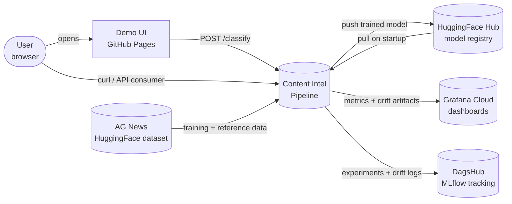
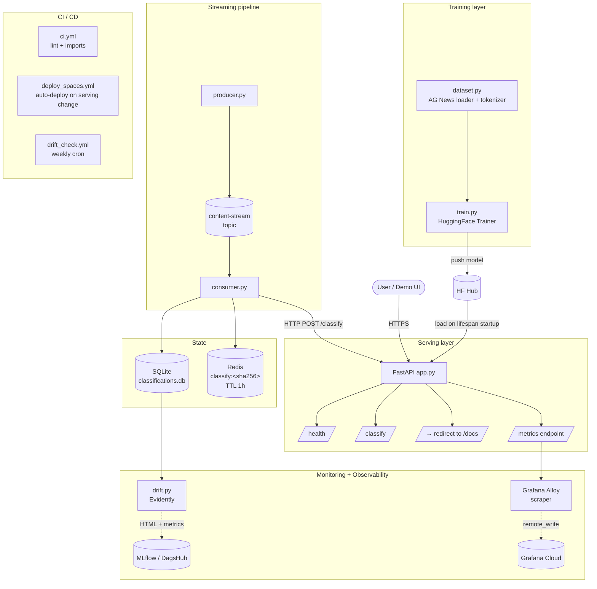
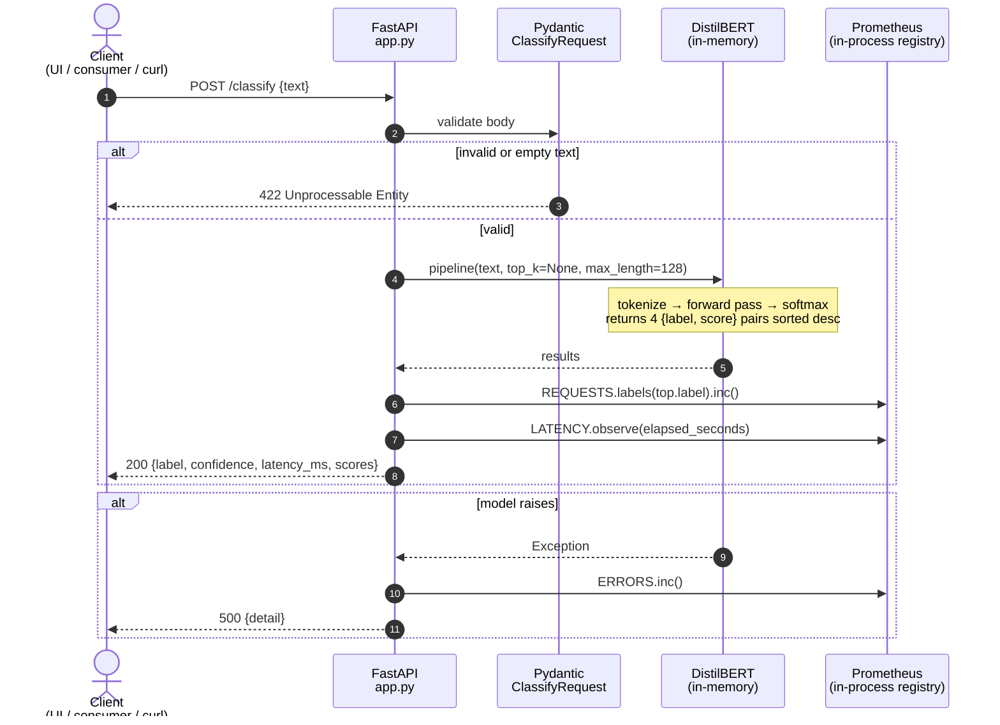
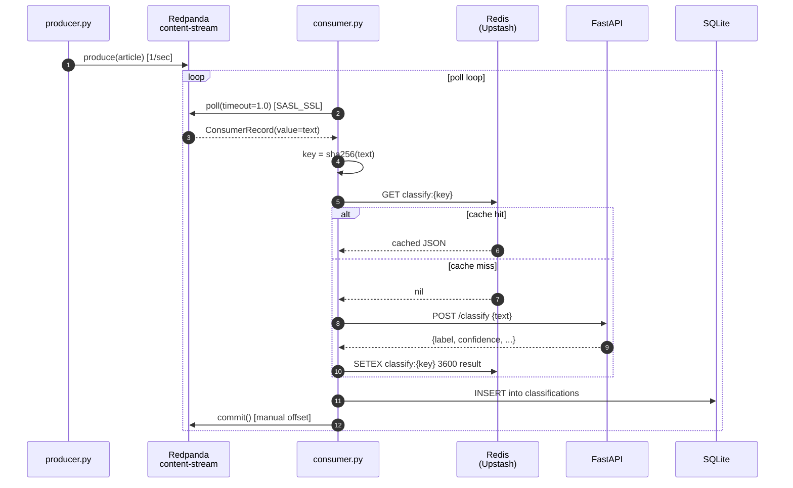
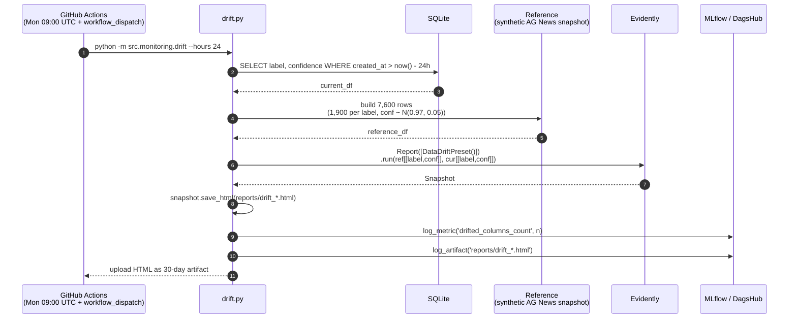
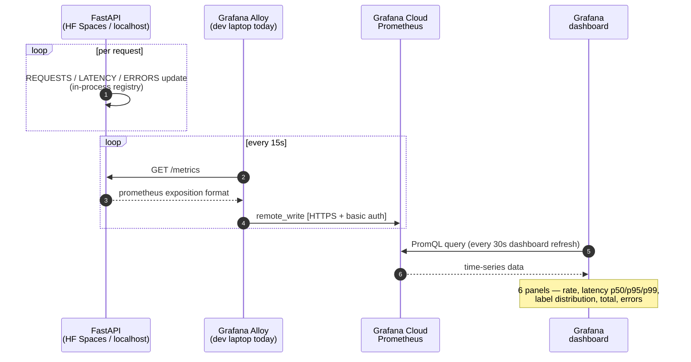
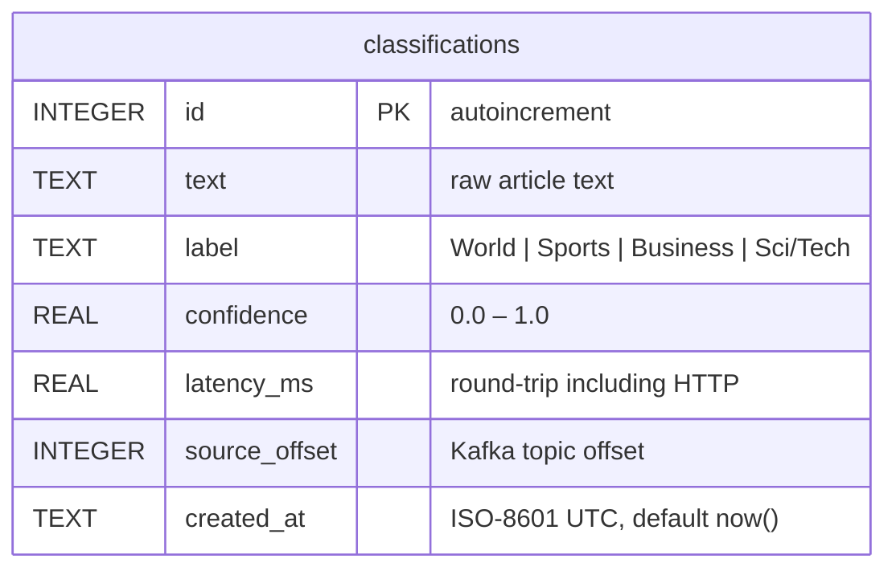
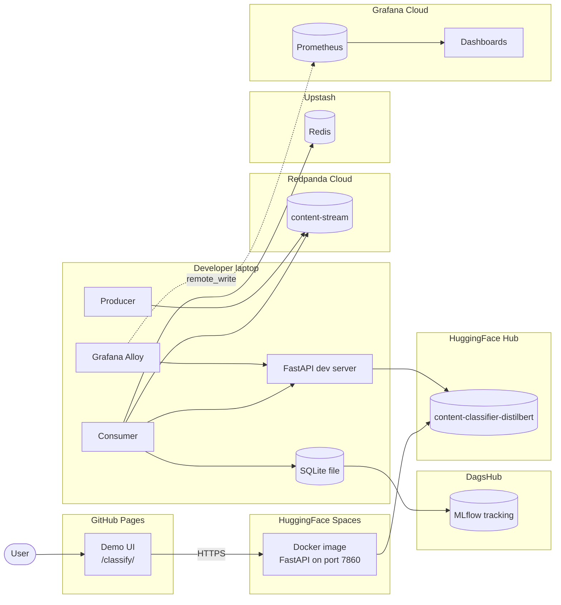

# Architecture — Content Intelligence Pipeline

> **How to keep this document up to date.** All diagrams below are written
> in [Mermaid](https://mermaid.js.org/) — plain text that GitHub renders
> as diagrams. When you add or change a component, update the relevant
> section *and* its Mermaid block in the same commit. Do not add binary
> images (PNG / SVG) for the core architecture: they go stale silently
> and cannot be diffed in a pull request.

---

## 1. Document map

| Section | What it covers |
|---|---|
| [§2 System context](#2-system-context) | What is inside the system, what is outside it |
| [§3 High-Level Design](#3-high-level-design) | All components and how they connect |
| [§4 Low-Level Design](#4-low-level-design) | Sequence diagrams for each key flow |
| [§5 Data model](#5-data-model) | Schemas: SQLite, Redis, Kafka topic, API contract |
| [§6 Cross-cutting concerns](#6-cross-cutting-concerns) | Secrets, failure modes, scaling |
| [§7 Deployment topology](#7-deployment-topology) | Where each component physically runs |
| [§8 Roadmap](#8-roadmap) | Concrete next steps not yet built |

A friendlier, non-technical version of this same architecture lives in
[`architecture-explained.md`](architecture-explained.md).

---

## 2. System context

Content Intel is a real-time news classifier. It accepts text (one
headline or one article excerpt at a time) and returns one of four
categories — *World, Sports, Business, Sci/Tech* — with a confidence
score. It exposes one HTTP endpoint, streams a continuous feed of
articles through a message broker for asynchronous classification, and
publishes operational metrics and drift reports to managed observability
services.



**External dependencies** (anything the system cannot live without):

| External | Used for | What breaks if it goes down |
|---|---|---|
| HuggingFace Hub | Model artifact storage | New replicas cannot boot. Already-running replicas keep working. |
| AG News dataset | Training + drift reference | Retraining and drift checks fail. Live inference unaffected. |
| Redpanda Cloud | Kafka broker | Streaming pipeline stalls. Direct `/classify` calls unaffected. |
| Upstash Redis | Cache | Cache misses everywhere — slower but functional. |
| DagsHub | MLflow tracking | Experiment logging fails silently. Training/drift still produces local artifacts. |
| Grafana Cloud | Metrics aggregation | Dashboards stop updating. Local `/metrics` still works. |

---

## 3. High-Level Design

Five logical layers, each independently deployable and observable.



### 3.1 Component responsibilities

| Layer | Component | Stack | Responsibility |
|---|---|---|---|
| Training | `src/training/dataset.py` | HuggingFace `datasets`, `transformers` | Load AG News, tokenize with DistilBERT tokenizer, return train/test splits |
| Training | `src/training/train.py` | PyTorch, HF `Trainer`, MLflow | Fine-tune `distilbert-base-uncased`, log metrics to MLflow, push best model to HF Hub |
| Serving | `src/serving/app.py` | FastAPI, transformers `pipeline`, `prometheus_client` | Host `/classify`, `/health`, `/metrics`, `/`; load model once via lifespan; emit metrics on every request |
| Pipeline | `src/pipeline/producer.py` | `confluent-kafka`, `datasets` | Stream AG News test articles into the broker at 1 msg/sec |
| Pipeline | `src/pipeline/consumer.py` | `confluent-kafka`, `redis`, `httpx`, `sqlite3` | Consume articles, dedupe via Redis, call `/classify`, persist to SQLite, manual commit |
| Monitoring | `src/monitoring/drift.py` | Evidently 0.7.x, pandas, MLflow | Compute statistical drift between reference and live distributions; emit HTML report + MLflow metric |
| Observability | (Grafana Alloy on dev machine) | Grafana Alloy | Scrape `/metrics` every 15s and `remote_write` to Grafana Cloud Prometheus |
| CI/CD | `.github/workflows/ci.yml` | GitHub Actions, ruff | Lint, verify each module imports cleanly with its own requirements file |
| CI/CD | `.github/workflows/drift_check.yml` | GitHub Actions, Evidently | Weekly cron — synthesize seed data, run drift report, upload as artifact |
| CI/CD | `.github/workflows/deploy_spaces.yml` | GitHub Actions, HF git remote | On change to `src/serving/**`, `Dockerfile`, or serving requirements — push to HF Space repo, triggering rebuild |
| Demo | `pranavsagar.github.io/classify/` | Vanilla HTML/CSS/JS | Static page, fetches `/classify`, renders animated 4-class breakdown |

---

## 4. Low-Level Design

### 4.1 Inference flow — `POST /classify` (synchronous, hot path)

Used by both the demo UI and the streaming consumer. Target latency p95 < 25ms on CPU.



**Key facts:**
- Model is loaded **once at startup** by the FastAPI `lifespan` context manager. Every request reuses the same in-memory `pipeline` object — no per-request load.
- `top_k=None` returns all 4 class probabilities sorted descending. This powers the UI's breakdown bars.
- Prometheus metrics live in the same Python process as FastAPI. Scraping `/metrics` returns the latest counter/histogram state.
- Failure isolation: an exception inside the model call increments `ERRORS` and returns 500. The process stays alive.

### 4.2 Streaming pipeline — Kafka consumer (asynchronous, at-least-once)

Used to process a continuous feed of articles without coupling producer speed to classifier speed.



**Key facts:**
- `enable.auto.commit=False` — offsets are committed only after the DB write succeeds. A crash between poll and commit causes the message to be re-delivered (at-least-once). Duplicates are harmless because the next consumer will get the same cached result.
- SHA-256 of the raw text is the cache key. News wires distribute identical articles to many outlets — deduplication is real-world useful, not theoretical.
- 1-hour TTL on cache entries gives a safe window for model upgrades. After a new model deploys, cached predictions expire within an hour without manual intervention.

### 4.3 Drift detection — `drift.py` (batch, weekly + on-demand)



**Key facts:**
- The reference is **synthetic** today — `np.random.normal(0.97, 0.05)` for confidence and 25% per label. This produces a false-positive on confidence drift because real DistilBERT outputs are bimodal, not Gaussian. Documented as a known limitation (build-log Problem 9). The fix is to seed the reference with a real baseline run; that's on the roadmap.
- Evidently 0.7.x picks the statistical test per column type — Jensen-Shannon for the categorical `label`, Wasserstein for the numeric `confidence`. Both are *distances*: higher = more drift, not p-values.
- The HTML report is the source of truth for human inspection. The MLflow-logged `drifted_columns_count` is the source of truth for programmatic alerting.

### 4.4 Observability — metrics flow



**Why pull + push hybrid?**
Prometheus' native model is pull (scrape). Grafana Cloud Prometheus is *managed*, so we cannot let it reach into our process directly. Alloy acts as the bridge: it pulls from FastAPI (standard Prometheus) and pushes to Grafana Cloud (Prometheus `remote_write`). When the app moves to Kubernetes, Alloy is replaced by a side-car or operator running inside the cluster — but the FastAPI side does not change.

### 4.5 CI / CD flow

```mermaid
sequenceDiagram
    autonumber
    actor Dev
    participant Repo as GitHub<br/>content-intel-pipeline
    participant CI as Actions: ci.yml
    participant CD as Actions: deploy_spaces.yml
    participant HFRepo as HF Space repo<br/>(git on huggingface.co)
    participant Space as Live HF Space<br/>(Docker container)

    Dev->>Repo: git push origin master
    Repo->>CI: trigger on every push
    CI->>CI: ruff lint
    CI->>CI: install each requirements-*.txt
    CI->>CI: import each module under test
    alt path matches src/serving/**, Dockerfile,<br/>requirements-serving.txt, hf_space_readme.md
        Repo->>CD: trigger deploy_spaces.yml
        CD->>HFRepo: git clone (HF_TOKEN auth)
        CD->>CD: rm -rf hf_space/src; cp -r src hf_space/
        CD->>CD: cp Dockerfile, requirements-serving.txt, README
        CD->>HFRepo: git commit --allow-empty + push
        HFRepo->>Space: docker rebuild
        Space-->>Dev: new image running
    end
```

**Key facts:**
- The deploy is `paths`-filtered. Editing docs or training code does not redeploy the Space.
- `workflow_dispatch` is enabled on `deploy_spaces.yml` for manual re-runs (e.g., after rotating a secret).
- The `rm -rf hf_space/src` before copy is load-bearing — without it, repeat deploys nested `src/` inside `src/` (build-log Problem 13).

---

## 5. Data model

### 5.1 SQLite — `classifications.db`



- One row per classification (whether cache hit or fresh inference).
- `source_offset` lets us correlate a row back to its Kafka message.
- Drift queries: `SELECT label, confidence FROM classifications WHERE created_at > datetime('now', '-24 hours')`.

### 5.2 Redis — cache layout

| Key | Value | TTL | Purpose |
|---|---|---|---|
| `classify:<sha256>` | JSON: `{"label", "confidence", "latency_ms"}` | 3600s | Deduplicate identical text across the stream |

`sha256` is the lowercase hex digest of the article bytes. Using a hash rather than the raw text keeps keys bounded in size and avoids any encoding issues with Redis key parsing.

### 5.3 Kafka — `content-stream` topic

| Property | Value |
|---|---|
| Partitions | 1 (single-consumer is sufficient at current scale) |
| Replication | Managed by Redpanda Cloud |
| Key | none |
| Value | UTF-8 string — raw article text |
| Retention | Default (Redpanda Cloud free tier) |
| Consumer group | `content-intel-consumer` |
| `auto.offset.reset` | `earliest` (replay from the start on new groups) |

### 5.4 API contract — `POST /classify`

```http
POST /classify HTTP/1.1
Content-Type: application/json

{ "text": "string, 1 to 512 chars" }
```

```http
HTTP/1.1 200 OK
Content-Type: application/json

{
  "label":      "Sci/Tech",
  "confidence": 0.9653,
  "latency_ms": 18.4,
  "scores": {
    "Sci/Tech": 0.9653,
    "Business": 0.0234,
    "World":    0.0084,
    "Sports":   0.0029
  }
}
```

Error responses:

| Code | Cause | Body |
|---|---|---|
| 422 | Empty text after `.strip()` or schema mismatch | `{"detail": "..."}` |
| 500 | Model raises during inference | `{"detail": "<exception>"}` (also increments `classify_errors_total`) |
| 503 | Health check before model has finished loading | `{"detail": "model not loaded"}` |

---

## 6. Cross-cutting concerns

### 6.1 Secrets and configuration

| Secret | Lives in | Used by |
|---|---|---|
| `HF_TOKEN` | GitHub repo secrets | `deploy_spaces.yml` (push to HF Space repo), `train.py` (push model) |
| `KAFKA_USERNAME` / `KAFKA_PASSWORD` / `KAFKA_BOOTSTRAP_SERVERS` | `.env` (gitignored) | producer + consumer |
| `REDIS_URL` (with auth) | `.env` | consumer |
| `MLFLOW_TRACKING_URI` / `_USERNAME` / `_PASSWORD` | GitHub secrets + local `.env` | `train.py`, `drift.py`, drift CI job |
| Grafana Alloy basic-auth credentials | Local Alloy config file (gitignored) | Alloy on dev machine |

`.env` is in `.gitignore`. The `.env.example` checked into the repo lists every variable name with an empty placeholder so a fresh clone can be configured.

### 6.2 Failure modes

| If this fails | What happens | Mitigation |
|---|---|---|
| HF Hub unreachable on startup | FastAPI `lifespan` raises; container does not become ready | Liveness probe (or HF Spaces' built-in) restarts the container |
| HF Hub unreachable after startup | Already-loaded model keeps serving | No action needed |
| Redis down | Consumer cache miss on every message | Falls through to API — slower, still correct |
| FastAPI returns 500 | Consumer logs and continues without committing | At-least-once: message is re-polled next loop iteration |
| Redpanda partition unavailable | Consumer poll returns empty | Streaming pauses; direct `/classify` traffic unaffected |
| SQLite write fails | Consumer raises before commit | At-least-once: message is re-polled |
| Grafana Alloy crashes | Metrics gap on the dashboard | Restart Alloy; in-process counters keep accumulating, gap fills on next scrape |
| DagsHub MLflow down | Drift job's `log_metric` raises | Drift HTML still saved locally; rerun the workflow later |

### 6.3 Scaling considerations

| Dimension | Current | Next bottleneck | Fix |
|---|---|---|---|
| Inference throughput | ~50 req/s on CPU (HF Spaces free) | Single container, single core | Run 2+ replicas behind a load balancer; switch to GPU container for >500 req/s |
| Consumer throughput | 1 msg/sec (rate-limited at producer) | Single partition, single consumer | Increase partition count, run N consumers in the same group |
| Cache size | Unbounded | Upstash free tier limit | Lower TTL or shard keys; consider local LRU cache as L1 |
| SQLite | Single-writer, file-backed | Concurrent writes from multiple consumers | Move to managed Postgres |
| Metrics | One Alloy on a laptop | Laptop offline = gap | Move scraper to the cluster (Prometheus operator) once on Kubernetes |
| Training | Local M-series MPS, ~82 min | Single device | Move to cloud GPU instance; or distributed training for larger models |

---

## 7. Deployment topology



**What runs where, and what it costs:**

| Component | Location | Cost |
|---|---|---|
| FastAPI (production) | HuggingFace Spaces | Free (CPU tier) |
| FastAPI (dev) | localhost:8000 | Free |
| Model | HuggingFace Hub | Free |
| Kafka | Redpanda Cloud | Free tier |
| Redis | Upstash | Free tier |
| MLflow | DagsHub | Free |
| Prometheus + dashboards | Grafana Cloud | Free tier (14-day trial → free indefinitely) |
| Demo UI | GitHub Pages | Free |
| Producer + consumer | Developer laptop today | Free |
| CI/CD | GitHub Actions | Free for public repos |

Total recurring cost: **$0**. Every dependency is either free-tier-managed or runs on the dev machine.

---

## 8. Roadmap

Concrete improvements scoped but not built. Listed in order of impact for an MLOps portfolio.

1. **Close the MLOps loop — retrain on drift.** Wire the weekly drift check to dispatch a retraining workflow when `drifted_columns_count > 0`. Versioned model artifact gets pushed back to HF Hub, then `deploy_spaces.yml` ships it.
2. **DVC for data versioning.** Track `/data/raw/` and `/artifacts/` with DVC so any past model can be reproduced from a commit SHA. The `.gitignore` is already prepared.
3. **Shadow A/B deployment.** Run a second model variant in the consumer, log its predictions to a separate table, compare distributions in the drift report. Demonstrates safe rollout without serving the new model.
4. **Replace synthetic drift reference with a real baseline.** Run the entire AG News test set through the live API, save the resulting `(label, confidence)` pairs as the reference. Eliminates the false positive on `confidence` drift.
5. **Batch inference endpoint.** `POST /classify/batch` taking a list of texts, returning a list of results. Reduces overhead for the streaming consumer.

Each of these is its own self-contained change. Update this section as items get built or as new ones get added.
